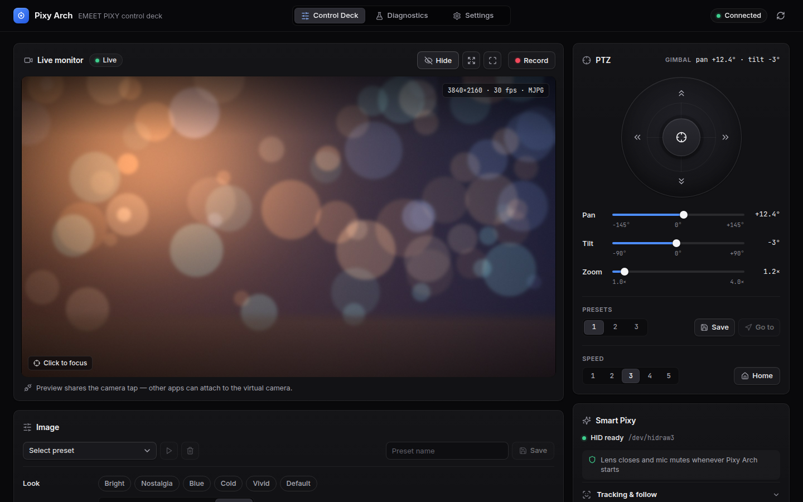
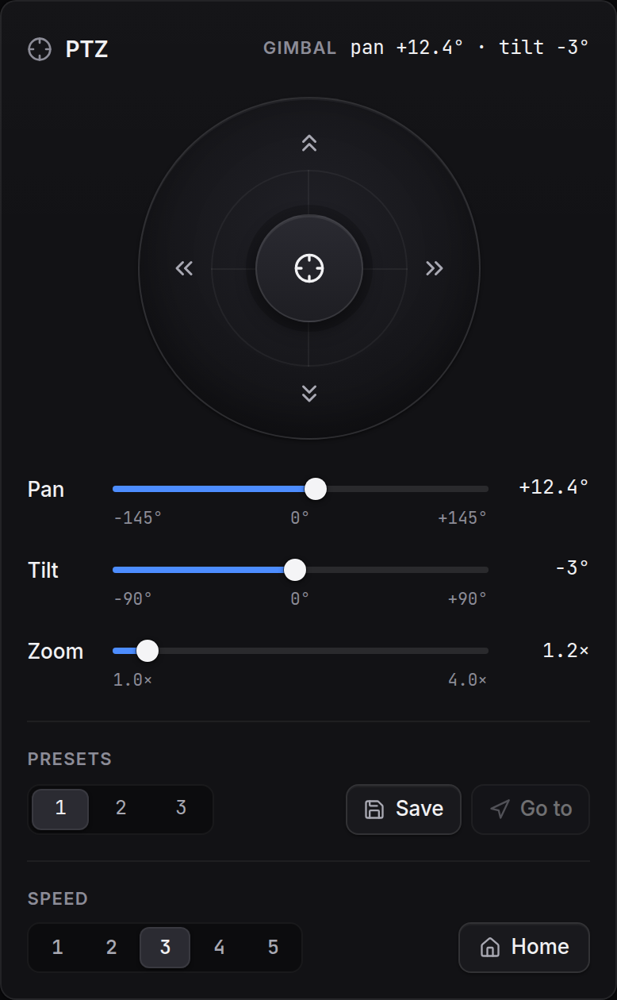
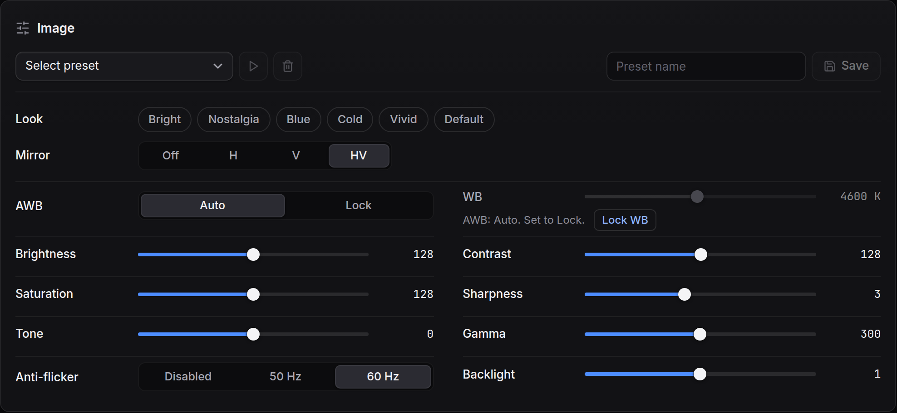
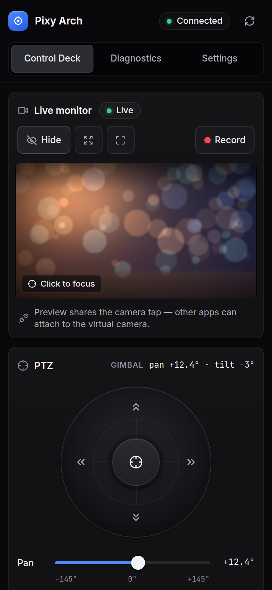
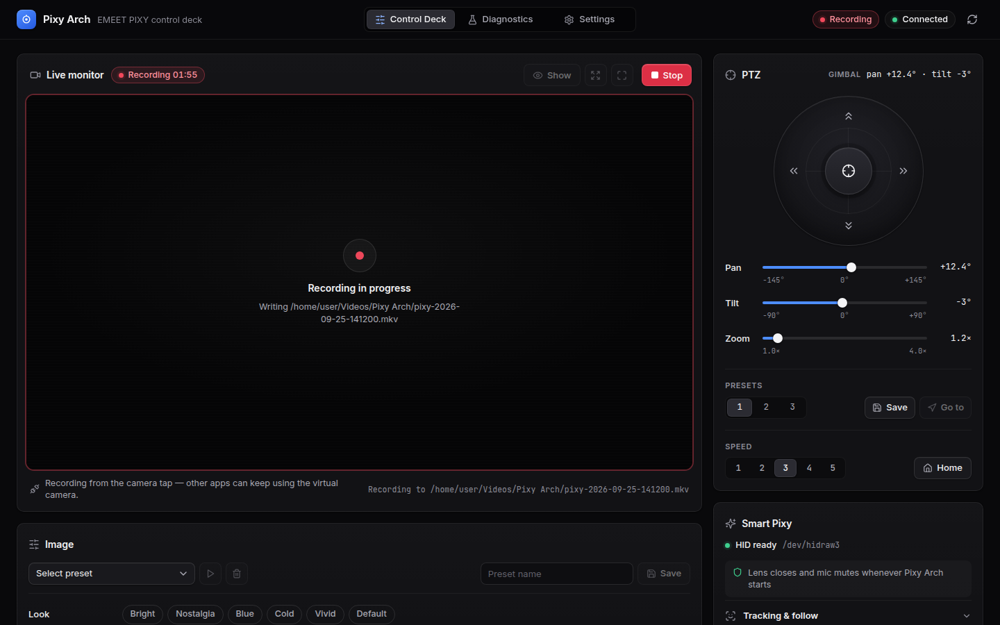
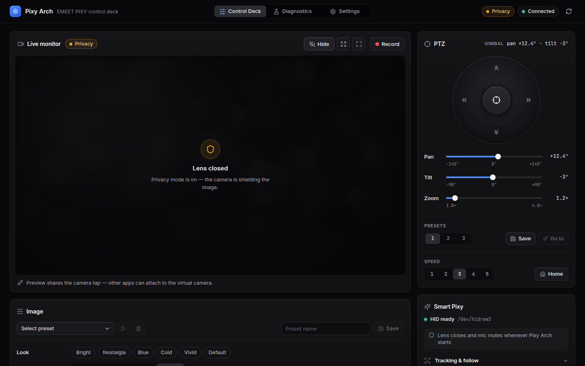

# Pixy Arch

A Linux control deck for the **EMEET PIXY** AI PTZ webcam: the camera controls EMEET Studio offers on Windows and macOS, as a local web app for Linux.

Pixy Arch runs a small backend on your computer and opens the deck in a browser window. Everything stays on your machine: there is no account, no cloud service, and no telemetry.

> Pixy Arch is an independent community project. It is not affiliated with or endorsed by EMEET. EMEET, PIXY, and EMEET Studio are trademarks of their respective owners. The vendor HID commands were reverse-engineered, so use them at your own risk.



| Pan, tilt, zoom | Image controls | On your phone |
| --- | --- | --- |
|  |  |  |

| Recording | Privacy mode |
| --- | --- |
|  |  |

<sub>Screenshots use a sample preview image.</sub>

## Features

- **Pan, tilt, zoom**: drag pad with eased speed, direction buttons, recenter, and the camera's native PTZ presets (save, load, clear, power-on default).
- **AI modes**: standard, auto-tracking, and privacy (lens covered, gimbal parked), plus gesture control, target-tracking modes, auto-rotate, mirror, and focus metering.
- **Image controls**: every V4L2 control the camera exposes (brightness, exposure, white balance, focus, and more) with auto/manual locks and named presets.
- **Live preview and recording**: MJPEG preview with click-to-focus and fullscreen, and recording to local `.mkv` files.
- **Virtual camera**: a "Pixy Arch Virtual" webcam (via v4l2loopback) with mirror, rotate, and zoom that OBS, browsers, and meeting apps can use. The real camera only streams while an app is actually reading it.
- **Call automation**: when an app opens the camera, switch to tracking and unmute the mic; when it closes, go back to privacy and mute. Configurable, and it can be turned off.
- **Microphone**: mute, gain, level meter, audio DSP modes, and a monitor-through-speakers test.
- **Privacy first**: on startup the backend covers the lens and mutes the mic by default.
- **Diagnostics**: HID and UVC snapshots, firmware information, hotplug detection, and a packet-capture inbox for reverse-engineering work.

## Requirements

- Linux with systemd: tested on **Arch Linux** and **Ubuntu 24.04+**.
- **Python 3.12+** with `venv`.
- **Node.js 22 LTS** (20.19+ also works). Ubuntu 24.04's `apt install nodejs` is too old; use [NodeSource](https://github.com/nodesource/distributions) or [nvm](https://github.com/nvm-sh/nvm).
- **ffmpeg**, **ALSA utils**, and **PipeWire** tools (`pw-dump`, `pw-cat`, `pw-loopback`, `wpctl`).

Ubuntu / Debian:

```bash
sudo apt install git curl python3-venv ffmpeg alsa-utils pipewire-bin wireplumber
```

Arch Linux:

```bash
sudo pacman -S --needed git curl python nodejs npm ffmpeg alsa-utils pipewire wireplumber
```

## Install

```bash
git clone https://github.com/Dkrynen/pixy-arch.git
cd pixy-arch

# One-time system setup (needs sudo): camera permissions + virtual camera.
sudo tools/setup-all.sh
```

Then unplug and replug the camera so the new permissions apply.

`setup-all.sh` installs a udev rule that lets your user send commands to the camera, and installs the v4l2loopback module that provides the virtual camera at `/dev/video10`. On Ubuntu with Secure Boot enabled, DKMS may ask you to enroll a signing key (MOK) on the next reboot; follow the blue screen prompts.

## Run

```bash
tools/run-pixypilot.sh
```

Open **http://127.0.0.1:8000**.

The first run takes a few minutes: it creates `backend/.venv`, installs dependencies, creates `config/pixypilot.yaml`, and builds the UI. Later runs start in seconds and only rebuild what changed.

### App launcher and start at login (optional)

```bash
tools/install-desktop.sh   # adds "Pixy Arch" to your app launcher
tools/install-service.sh   # runs the backend at login (systemd user service)
```

The launcher starts the backend if it isn't running and opens the deck in an app window. It uses a Chromium-family browser (Brave, Chromium, Chrome, Edge, or Vivaldi) if one is installed, and your default browser otherwise. Set `PIXY_ARCH_BROWSER` to pick one. Re-run both scripts if you move the checkout. Remove the service with `tools/install-service.sh --uninstall`.

### Update

```bash
git pull
tools/run-pixypilot.sh    # or: systemctl --user restart pixypilot.service
```

## How it behaves by default

- **At startup** the backend puts the camera into privacy mode (lens covered) and mutes the PIXY microphone.
- **Call automation** watches the camera. When any app opens it, Pixy Arch switches to tracking and unmutes the mic. About 8 seconds after the last app closes it, Pixy Arch returns to privacy and mutes again. Change or disable this in the Automation panel or under `automation:` in the config.
- **The virtual camera** stays listed in other apps while idle by showing a dark standby frame, without opening the real camera. When an app starts reading it, the real camera pipeline starts within a second or two.

## Configuration

Settings live in `config/pixypilot.yaml`, created from [`config/pixypilot.example.yaml`](config/pixypilot.example.yaml) on first run. Most of them can also be changed in the app's Settings view. See [docs/CONFIGURATION.md](docs/CONFIGURATION.md) for every option.

### Security

The deck has **no login**. By default it listens only on `127.0.0.1`, so only your own computer can reach it, and it rejects requests from other websites open in your browser (cross-site requests and DNS rebinding).

If you set `server.host: 0.0.0.0`, **anyone on your network** can view the camera, record, move it, and unmute the microphone. Only do that on a network you trust, and switch back afterwards. See [SECURITY.md](SECURITY.md) to report a vulnerability.

## Troubleshooting

- **Smart controls are greyed out or report "not writable"**: run `sudo tools/setup-all.sh`, then replug the camera. `getfacl /dev/hidrawN` should list your user, and `http://127.0.0.1:8000/api/pixy-hid/status` should report `"writable": true`.
- **No "Pixy Arch Virtual" camera in other apps**: check that `/dev/video10` exists. If not, rerun `sudo tools/setup-virtualcam.sh` and read its error. After a kernel update, the DKMS module may need a reboot.
- **The preview says the camera is busy**: another app has the physical camera open. Use the virtual camera in that app instead, so both can run at once.
- **First run fails with a Node or Python version error**: install the versions listed under [Requirements](#requirements).
- **Logs**: `journalctl --user -u pixypilot.service -f` when running as a service. When started from the launcher without the service: `~/.local/state/pixy-arch/backend.log`.

## Development

See [CONTRIBUTING.md](CONTRIBUTING.md) for the developer setup, tests, and code layout. In short: a FastAPI backend in `backend/src/pixypilot` talks to the camera through native V4L2 ioctls, hidraw, ffmpeg, and PipeWire tools, and a React + TypeScript UI in `frontend/` is served by the backend. The internal package and service names are `pixypilot`. [docs/ARCHITECTURE.md](docs/ARCHITECTURE.md) explains the video and virtual camera pipeline.

Reverse-engineering notes for the camera's HID protocol and UVC extension unit are in [docs/EMEET_PIXY_REVERSE_ENGINEERING.md](docs/EMEET_PIXY_REVERSE_ENGINEERING.md), [docs/EMEET_PIXY_HID_REFERENCE.md](docs/EMEET_PIXY_HID_REFERENCE.md), and [docs/UVC_EXTENSION_CORRELATION.md](docs/UVC_EXTENSION_CORRELATION.md).

## Credits

Pixy Arch is created and maintained by **Duan Krynen** ([@Dkrynen](https://github.com/Dkrynen)).

Pixy Arch started from **[PixyPilot](https://github.com/Romonaga/PixyPilot) by Romonaga**, which contributed the original backend and UI foundation, the native V4L2 layer, the first decoded HID commands, and the reverse-engineering notes in `docs/`.

It also builds on public EMEET PIXY research by:

- [`rm1138`](https://gist.github.com/rm1138/ef132c3a39f3c1effabf6354e2eca965): the first public Linux HID reference for the camera.
- [`LarsArtmann/emeet-pixyd`](https://github.com/LarsArtmann/emeet-pixyd): independent confirmation of the tracking, privacy, gesture, and audio command families.
- [`RoseWaveStudio/PixyBar`](https://github.com/RoseWaveStudio/PixyBar): target-tracking modes, degree-based PTZ moves, and response masking.
- [`nick0413/Emeet_pixy_for_linux`](https://github.com/nick0413/Emeet_pixy_for_linux): confirmation of the V4L2 plus vendor HID split.

## License

A license has not been published yet. Until a `LICENSE` file is added to this repository, no license is granted to use, copy, or modify this code.
